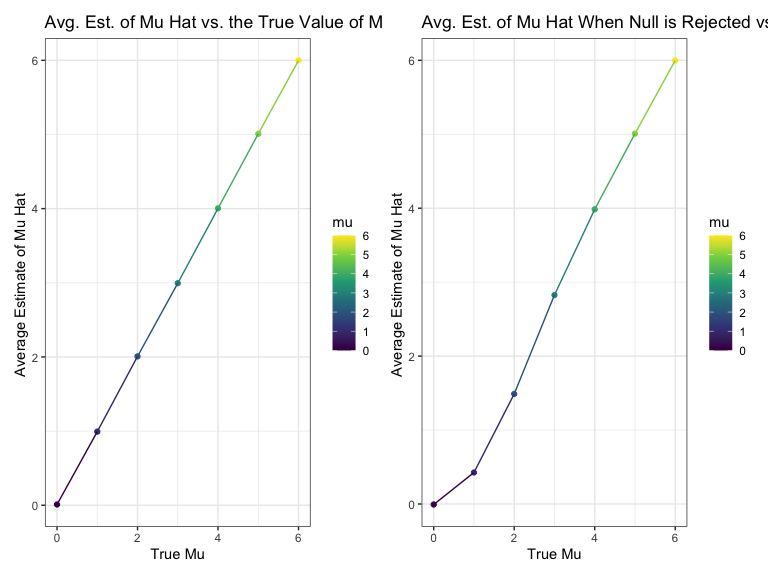

Homework 5
================
Vasili Fokaidis

## Problem 1

Read in the data.

``` r
homocide_df = 
  read_csv("homocide_data/homicide-data.csv") %>%
  mutate(
    city_state = str_c(city, state, sep = "_"),
    resolved = case_when(
      disposition == "Closed without arrest" ~ "unsolved",
      disposition == "Open/No arrest" ~ "unsolved",
      disposition == "Closed by arrest" ~ "solved"
    )
  ) %>%
  select(city_state, resolved) %>%
  filter(city_state != "Tulsa_AL")
```

    ## Parsed with column specification:
    ## cols(
    ##   uid = col_character(),
    ##   reported_date = col_double(),
    ##   victim_last = col_character(),
    ##   victim_first = col_character(),
    ##   victim_race = col_character(),
    ##   victim_age = col_character(),
    ##   victim_sex = col_character(),
    ##   city = col_character(),
    ##   state = col_character(),
    ##   lat = col_double(),
    ##   lon = col_double(),
    ##   disposition = col_character()
    ## )

Let’s look at this a bit

``` r
aggregate_df =
homocide_df %>%
  group_by(city_state) %>%
  summarize(
    hom_total = n(),
    hom_unsolved = sum(resolved == "unsolved")
  )
```

    ## `summarise()` ungrouping output (override with `.groups` argument)

Can I do a prop test for a single city?

``` r
prop.test(
  aggregate_df %>% filter(city_state == "Baltimore_MD") %>% pull(hom_unsolved),
  aggregate_df %>% filter(city_state == "Baltimore_MD") %>% pull(hom_total)) %>%
  broom::tidy()
```

    ## # A tibble: 1 x 8
    ##   estimate statistic  p.value parameter conf.low conf.high method    alternative
    ##      <dbl>     <dbl>    <dbl>     <int>    <dbl>     <dbl> <chr>     <chr>      
    ## 1    0.646      239. 6.46e-54         1    0.628     0.663 1-sample… two.sided

Try to iterate ……..

``` r
results_df =
aggregate_df %>%
  mutate(
    prop_tests = map2(.x = hom_unsolved, .y = hom_total, ~prop.test(x = .x, n = .y)),
    tidy_tests = map(.x = prop_tests, ~broom::tidy(.x))
  ) %>%
  select(-prop_tests) %>%
  unnest(tidy_tests) %>%
  select(city_state, estimate, conf.low, conf.high)
```

``` r
results_df %>%
  mutate(city_state = fct_reorder(city_state, estimate)) %>%
  ggplot(aes(x = city_state, y = estimate)) +
  geom_point() +
  geom_errorbar(aes(ymin = conf.low, ymax = conf.high)) +
  theme(axis.text.x = element_text(angle = 90, vjust = 0.5, hjust = 1))
```


## Problem 2

Importing one data set to see what data I’m working with and creating
dataframe to store data.

``` r
data_1 = read_csv("ldl_data/con_01.csv")
```

    ## Parsed with column specification:
    ## cols(
    ##   week_1 = col_double(),
    ##   week_2 = col_double(),
    ##   week_3 = col_double(),
    ##   week_4 = col_double(),
    ##   week_5 = col_double(),
    ##   week_6 = col_double(),
    ##   week_7 = col_double(),
    ##   week_8 = col_double()
    ## )

Creating a function to iterate over file names and read in data.

``` r
data_read = function(df) {
 
  data = read_csv(df)

}
```

Iterating over all file names to read in data using `purrr:map` and
saving variable in the dataframe.

``` r
path_df =
  tibble(
    path = list.files("ldl_data")
  ) %>%
  mutate(
    path = str_c("ldl_data/", path),
    ldl_data = map(path, data_read)) %>%
  unnest(ldl_data)
```

    ## Parsed with column specification:
    ## cols(
    ##   week_1 = col_double(),
    ##   week_2 = col_double(),
    ##   week_3 = col_double(),
    ##   week_4 = col_double(),
    ##   week_5 = col_double(),
    ##   week_6 = col_double(),
    ##   week_7 = col_double(),
    ##   week_8 = col_double()
    ## )
    ## Parsed with column specification:
    ## cols(
    ##   week_1 = col_double(),
    ##   week_2 = col_double(),
    ##   week_3 = col_double(),
    ##   week_4 = col_double(),
    ##   week_5 = col_double(),
    ##   week_6 = col_double(),
    ##   week_7 = col_double(),
    ##   week_8 = col_double()
    ## )
    ## Parsed with column specification:
    ## cols(
    ##   week_1 = col_double(),
    ##   week_2 = col_double(),
    ##   week_3 = col_double(),
    ##   week_4 = col_double(),
    ##   week_5 = col_double(),
    ##   week_6 = col_double(),
    ##   week_7 = col_double(),
    ##   week_8 = col_double()
    ## )
    ## Parsed with column specification:
    ## cols(
    ##   week_1 = col_double(),
    ##   week_2 = col_double(),
    ##   week_3 = col_double(),
    ##   week_4 = col_double(),
    ##   week_5 = col_double(),
    ##   week_6 = col_double(),
    ##   week_7 = col_double(),
    ##   week_8 = col_double()
    ## )
    ## Parsed with column specification:
    ## cols(
    ##   week_1 = col_double(),
    ##   week_2 = col_double(),
    ##   week_3 = col_double(),
    ##   week_4 = col_double(),
    ##   week_5 = col_double(),
    ##   week_6 = col_double(),
    ##   week_7 = col_double(),
    ##   week_8 = col_double()
    ## )
    ## Parsed with column specification:
    ## cols(
    ##   week_1 = col_double(),
    ##   week_2 = col_double(),
    ##   week_3 = col_double(),
    ##   week_4 = col_double(),
    ##   week_5 = col_double(),
    ##   week_6 = col_double(),
    ##   week_7 = col_double(),
    ##   week_8 = col_double()
    ## )
    ## Parsed with column specification:
    ## cols(
    ##   week_1 = col_double(),
    ##   week_2 = col_double(),
    ##   week_3 = col_double(),
    ##   week_4 = col_double(),
    ##   week_5 = col_double(),
    ##   week_6 = col_double(),
    ##   week_7 = col_double(),
    ##   week_8 = col_double()
    ## )
    ## Parsed with column specification:
    ## cols(
    ##   week_1 = col_double(),
    ##   week_2 = col_double(),
    ##   week_3 = col_double(),
    ##   week_4 = col_double(),
    ##   week_5 = col_double(),
    ##   week_6 = col_double(),
    ##   week_7 = col_double(),
    ##   week_8 = col_double()
    ## )
    ## Parsed with column specification:
    ## cols(
    ##   week_1 = col_double(),
    ##   week_2 = col_double(),
    ##   week_3 = col_double(),
    ##   week_4 = col_double(),
    ##   week_5 = col_double(),
    ##   week_6 = col_double(),
    ##   week_7 = col_double(),
    ##   week_8 = col_double()
    ## )
    ## Parsed with column specification:
    ## cols(
    ##   week_1 = col_double(),
    ##   week_2 = col_double(),
    ##   week_3 = col_double(),
    ##   week_4 = col_double(),
    ##   week_5 = col_double(),
    ##   week_6 = col_double(),
    ##   week_7 = col_double(),
    ##   week_8 = col_double()
    ## )
    ## Parsed with column specification:
    ## cols(
    ##   week_1 = col_double(),
    ##   week_2 = col_double(),
    ##   week_3 = col_double(),
    ##   week_4 = col_double(),
    ##   week_5 = col_double(),
    ##   week_6 = col_double(),
    ##   week_7 = col_double(),
    ##   week_8 = col_double()
    ## )
    ## Parsed with column specification:
    ## cols(
    ##   week_1 = col_double(),
    ##   week_2 = col_double(),
    ##   week_3 = col_double(),
    ##   week_4 = col_double(),
    ##   week_5 = col_double(),
    ##   week_6 = col_double(),
    ##   week_7 = col_double(),
    ##   week_8 = col_double()
    ## )
    ## Parsed with column specification:
    ## cols(
    ##   week_1 = col_double(),
    ##   week_2 = col_double(),
    ##   week_3 = col_double(),
    ##   week_4 = col_double(),
    ##   week_5 = col_double(),
    ##   week_6 = col_double(),
    ##   week_7 = col_double(),
    ##   week_8 = col_double()
    ## )
    ## Parsed with column specification:
    ## cols(
    ##   week_1 = col_double(),
    ##   week_2 = col_double(),
    ##   week_3 = col_double(),
    ##   week_4 = col_double(),
    ##   week_5 = col_double(),
    ##   week_6 = col_double(),
    ##   week_7 = col_double(),
    ##   week_8 = col_double()
    ## )
    ## Parsed with column specification:
    ## cols(
    ##   week_1 = col_double(),
    ##   week_2 = col_double(),
    ##   week_3 = col_double(),
    ##   week_4 = col_double(),
    ##   week_5 = col_double(),
    ##   week_6 = col_double(),
    ##   week_7 = col_double(),
    ##   week_8 = col_double()
    ## )
    ## Parsed with column specification:
    ## cols(
    ##   week_1 = col_double(),
    ##   week_2 = col_double(),
    ##   week_3 = col_double(),
    ##   week_4 = col_double(),
    ##   week_5 = col_double(),
    ##   week_6 = col_double(),
    ##   week_7 = col_double(),
    ##   week_8 = col_double()
    ## )
    ## Parsed with column specification:
    ## cols(
    ##   week_1 = col_double(),
    ##   week_2 = col_double(),
    ##   week_3 = col_double(),
    ##   week_4 = col_double(),
    ##   week_5 = col_double(),
    ##   week_6 = col_double(),
    ##   week_7 = col_double(),
    ##   week_8 = col_double()
    ## )
    ## Parsed with column specification:
    ## cols(
    ##   week_1 = col_double(),
    ##   week_2 = col_double(),
    ##   week_3 = col_double(),
    ##   week_4 = col_double(),
    ##   week_5 = col_double(),
    ##   week_6 = col_double(),
    ##   week_7 = col_double(),
    ##   week_8 = col_double()
    ## )
    ## Parsed with column specification:
    ## cols(
    ##   week_1 = col_double(),
    ##   week_2 = col_double(),
    ##   week_3 = col_double(),
    ##   week_4 = col_double(),
    ##   week_5 = col_double(),
    ##   week_6 = col_double(),
    ##   week_7 = col_double(),
    ##   week_8 = col_double()
    ## )
    ## Parsed with column specification:
    ## cols(
    ##   week_1 = col_double(),
    ##   week_2 = col_double(),
    ##   week_3 = col_double(),
    ##   week_4 = col_double(),
    ##   week_5 = col_double(),
    ##   week_6 = col_double(),
    ##   week_7 = col_double(),
    ##   week_8 = col_double()
    ## )

Tidying the result into a new dataframe.

``` r
ldl_df =
  path_df %>%
    mutate(
      subject_id = substring(path_df$path, 14, 15),
      arm = substring(path_df$path, 10, 12)) %>%
    select(arm, subject_id, week_1, week_2, week_3, week_4, week_5, week_6, week_7, week_8)

ldl_df
```

    ## # A tibble: 20 x 10
    ##    arm   subject_id week_1 week_2 week_3 week_4 week_5 week_6 week_7 week_8
    ##    <chr> <chr>       <dbl>  <dbl>  <dbl>  <dbl>  <dbl>  <dbl>  <dbl>  <dbl>
    ##  1 con   01           0.2  -1.31    0.66   1.96   0.23   1.09   0.05   1.94
    ##  2 con   02           1.13 -0.88    1.07   0.17  -0.83  -0.31   1.58   0.44
    ##  3 con   03           1.77  3.11    2.22   3.26   3.31   0.89   1.88   1.01
    ##  4 con   04           1.04  3.66    1.22   2.33   1.47   2.7    1.87   1.66
    ##  5 con   05           0.47 -0.580  -0.09  -1.37  -0.32  -2.17   0.45   0.48
    ##  6 con   06           2.37  2.5     1.59  -0.16   2.08   3.07   0.78   2.35
    ##  7 con   07           0.03  1.21    1.13   0.64   0.49  -0.12  -0.07   0.46
    ##  8 con   08          -0.08  1.42    0.09   0.36   1.18  -1.16   0.33  -0.44
    ##  9 con   09           0.08  1.24    1.44   0.41   0.95   2.75   0.3    0.03
    ## 10 con   10           2.14  1.15    2.52   3.44   4.26   0.97   2.73  -0.53
    ## 11 exp   01           3.05  3.67    4.84   5.8    6.33   5.46   6.38   5.91
    ## 12 exp   02          -0.84  2.63    1.64   2.58   1.24   2.32   3.11   3.78
    ## 13 exp   03           2.15  2.08    1.82   2.84   3.36   3.61   3.37   3.74
    ## 14 exp   04          -0.62  2.54    3.78   2.73   4.49   5.82   6      6.49
    ## 15 exp   05           0.7   3.33    5.34   5.57   6.9    6.66   6.24   6.95
    ## 16 exp   06           3.73  4.08    5.4    6.41   4.87   6.09   7.66   5.83
    ## 17 exp   07           1.18  2.35    1.23   1.17   2.02   1.61   3.13   4.88
    ## 18 exp   08           1.37  1.43    1.84   3.6    3.8    4.72   4.68   5.7 
    ## 19 exp   09          -0.4   1.08    2.66   2.7    2.8    2.64   3.51   3.27
    ## 20 exp   10           1.09  2.8     2.8    4.3    2.25   6.57   6.09   4.64

Spaghetti plot of observations on each subject from each arm over time.

``` r
con_exp_plot =
  
ldl_df %>%
  pivot_longer(
    week_1:week_8,
    names_to = "week",
    values_to = "ldl"
  ) %>%
  mutate(
    week = substring(week, 6),
    week = as.numeric(week)
  ) %>%
  ggplot(aes(x = week, y = ldl, color = subject_id, linetype = arm))  +
  geom_point() +
  geom_line()+
  labs(
    title = "Experimental and Control Arm LDL Levels Over Time",
    x = "Week",
    y = "LDL Level"
    ) +
  theme_bw()

con_exp_plot
```


Separate spaghetti plots of observations on each subject from each arm
over time.

``` r
con_plot = 
  
  ldl_df %>%
  mutate(
    subject_id_arm = str_c(arm, subject_id)
  ) %>%
  select(-arm, -subject_id) %>%
  slice(-11:-20) %>%
   pivot_longer(
    week_1:week_8,
    names_to = "week",
    values_to = "ldl"
  ) %>%
  mutate(
    week = substring(week, 6),
    week = as.numeric(week)
  ) %>%
  ggplot(aes(x = week, y = ldl, color = subject_id_arm)) +
  geom_point() +
  geom_line() +
  labs(
    title = "Control Arm LDL Levels Over Time",
    x = "Week",
    y = "LDL Level"
    ) +
  theme_bw()

exp_plot =
  
  ldl_df %>%
  mutate(
    subject_id_arm = str_c(arm, subject_id)
  ) %>%
  select(-arm, -subject_id) %>%
  slice(-1:-10) %>%
   pivot_longer(
    week_1:week_8,
    names_to = "week",
    values_to = "ldl"
  ) %>%
  mutate(
    week = substring(week, 6),
    week = as.numeric(week)
  ) %>%
  ggplot(aes(x = week, y = ldl, color = subject_id_arm)) +
  geom_point() +
  geom_line()+
   labs(
    title = "Experimental Arm LDL Levels Over Time",
    x = "Week",
    y = "LDL Level"
    ) + 
  theme_bw()

con_plot + exp_plot
```


The first spaghetti plot is rather busy making it hard to deduce any
observable difference between the control group and experimental group.
But, by separating the two groups and plotting their data individually,
we can see that the experimental group shows to have higher ldl levels
over time. In terms of the study, without further information regarding
the treatment for experimental subjects, it looks as though their
treatment has raised ldl levels which normally is not good.

## Problem 3

Let’s simulate 5000 datasets, where n = 30, mu = 0, and sigma = 5.

``` r
sim_data = function(samp_size, mu = 0, sigma = 5) {
  
  data = 
  tibble(
    x = rnorm(n = samp_size, mean = mu, sd = sigma)
  )
  
   data %>%
    summarize(
      broom::tidy(t.test(x))
      ) %>%
     select(estimate, p.value)
}

output_0 = bind_rows(map(.x = 30, ~ rerun(5000, sim_data(.x))))

output_0 = 
  output_0 %>%
  tibble(
    mu = 0)

output_0
```

    ## # A tibble: 5,000 x 3
    ##    estimate p.value    mu
    ##       <dbl>   <dbl> <dbl>
    ##  1    0.277   0.674     0
    ##  2    0.745   0.375     0
    ##  3   -0.493   0.588     0
    ##  4    0.266   0.773     0
    ##  5    0.205   0.795     0
    ##  6    0.931   0.415     0
    ##  7    0.413   0.580     0
    ##  8    0.793   0.397     0
    ##  9   -0.515   0.598     0
    ## 10    1.35    0.181     0
    ## # … with 4,990 more rows

Repeat above for mu = {1, 2, 3, 4, 5, 6}

``` r
mu = c(1, 2, 3, 4, 5, 6)

output_1 = vector("list", length = 6)

for(i in 1:6) {
  output_1[[i]] = rerun(5000, sim_data(30, mu = mu[[i]])) %>% 
    bind_rows()
}

output_1 = 
  output_1 %>%
  tibble(
    mu = c(1, 2, 3, 4, 5, 6)
  ) %>%
  unnest()

output_1
```

    ## # A tibble: 30,000 x 3
    ##    estimate p.value    mu
    ##       <dbl>   <dbl> <dbl>
    ##  1    0.699  0.519      1
    ##  2    1.67   0.0896     1
    ##  3    0.375  0.574      1
    ##  4    1.50   0.225      1
    ##  5    0.392  0.712      1
    ##  6    0.392  0.695      1
    ##  7    0.893  0.338      1
    ##  8    0.774  0.205      1
    ##  9    0.534  0.426      1
    ## 10    1.00   0.249      1
    ## # … with 29,990 more rows

Final ouput dataset containing estimate, p-value, and respective mu
value of simulations with specified sample size, mu values, and sigma
value.

``` r
output = bind_rows(output_0, output_1)

output
```

    ## # A tibble: 35,000 x 3
    ##    estimate p.value    mu
    ##       <dbl>   <dbl> <dbl>
    ##  1    0.277   0.674     0
    ##  2    0.745   0.375     0
    ##  3   -0.493   0.588     0
    ##  4    0.266   0.773     0
    ##  5    0.205   0.795     0
    ##  6    0.931   0.415     0
    ##  7    0.413   0.580     0
    ##  8    0.793   0.397     0
    ##  9   -0.515   0.598     0
    ## 10    1.35    0.181     0
    ## # … with 34,990 more rows

Function to find proportion based on mu value.

``` r
prop_rej = function(x) {
  
output %>%
  filter(
    mu == x,
    p.value < 0.05
    ) %>%
  select(p.value) %>%
  nrow()/5000
  
}
```

Plot containing proportion of rejections of the null against each
respective mu value.

``` r
prop_rej_plot = 
  
  tibble(
    prop = map(unique(output$mu), prop_rej),
    mu = unique(output$mu)
  ) %>%
  unnest() %>%
  ggplot(aes(x = mu, y = prop, color = mu)) + 
  geom_point() +
  geom_line() +
  labs(
    title = "Proportion of Rejections of Null vs. Mu Value",
    x = "Mu Value",
    y = "Proportion of Rejections"
  ) +
  theme_bw()

prop_rej_plot
```


As the sample mean increases the power of the test also increases
because the rejection of the null hypothesis happens more and more
often.

Functions to make plots of average estimate of mu vs true value of mu
and average estimate of mu hat where null is rejected vs true value of
mu.

``` r
avg_estimate = function(x) {
  
output %>%
  filter(
    mu == x
  ) %>%
  select(
    estimate
    ) %>%
 sum()/5000
  
}

avg_estimate_rej = function(x) {
  
output %>%
  filter(
    mu == x,
    p.value < 0.05
    ) %>%
  select(estimate) %>%
  sum()/5000
  
}
```

Plots showing average estimate of mu hat vs the true value of mu and
average estimate of mu hat where null is rejected vs true value of mu.

``` r
plot_avg_true = 
  
tibble(
    mu = unique(output$mu),
    avg_of_estimate = map(mu, avg_estimate)
  ) %>%
  unnest() %>%
  ggplot(aes(x = mu, y = avg_of_estimate, color = mu)) +
  geom_point() +
  labs(
    title = "Avg. Est. of Mu Hat vs. the True Value of Mu",
    x = "True Mu",
    y = "Average Estimate of Mu Hat "
  ) +
  geom_line() +
  theme_bw()


plot_avg_rej_true = 
  
  tibble(
    mu = unique(output$mu),
    avg_of_rej_estimate = map(mu, avg_estimate_rej)
  ) %>%
  unnest() %>%
  ggplot(aes(x = mu, y = avg_of_rej_estimate, color = mu)) +
  geom_point() +
  labs(
    title = "Avg. Est. of Mu Hat When Null is Rejected vs. the True Value of Mu",
    x = "True Mu",
    y = "Average Estimate of Mu Hat "
  ) +
  geom_line() +
  theme_bw()

plot_avg_true + plot_avg_rej_true
```



The sample average of mu hat across tests for which the null is rejected
is not approximately equal to the true value of mu until the values of
mu are larger than 3. This is because the amount of rejections increases
as the sample average of mu hat increases, thus making the average
closer to the respective mu value.
